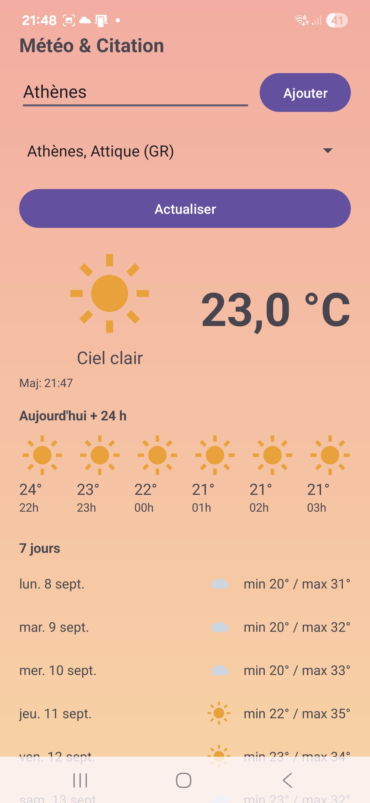

# Météo & Citation (Android, Kotlin)

App météo légère : **actuel**, **24 h**, **7 jours** + **citation** adaptée au temps.  
Recherche de villes (Open-Meteo Geocoding), persistance, **thème dynamique** (crossfade), bouton **Envoyer un retour**.

## Fonctionnalités
- Météo **actuelle**, **24 h** (heure par heure), **7 jours** (min/max)
- Recherche de villes + **persistance** (SharedPreferences)
- **Icônes couleur** + **thème** qui s’adapte à la météo (WMO → UI)
- **Citations** contextualisées + bouton “Nouvelle citation”
- **Feedback** (mailto) avec infos techniques pré-remplies

## Stack
- **Kotlin**, Coroutines, Java 17 (desugaring `java.time`)
- **Android Views/XML**, WindowInsets (edge-to-edge Android 15)
- Réseau **Open-Meteo** (`URL.openStream()`), `org.json`
- **Gradle Kotlin DSL**, R8/ProGuard + shrink resources

## Build
- Android Studio **Narwhal 3** (JDK 17)
- `minSdk 24` / `targetSdk 35`
- Desugaring activée (`coreLibraryDesugaring`)
- Débogage local : `./gradlew assembleDebug`

> ⚠️ Ne pas versionner `*.jks`, `key.properties`, `local.properties`.

## Licence
[MIT](LICENSE)
